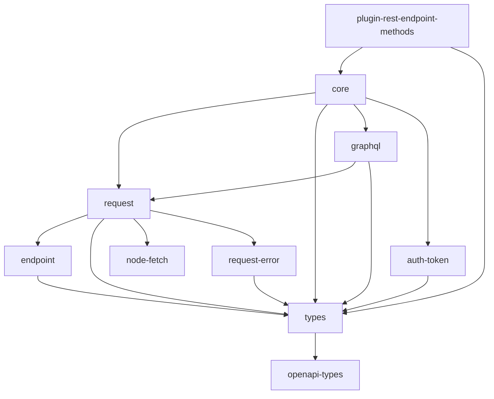

# Octokit for Deno

Even though octokit does officially supports Deno, Octokit libraries do not have sufficient
support for Deno, for example customizing requests.  
So I reimplement octokit in Deno to support these cases.

## Considerations for Porting

- `openapi-types` and `plugin-rest-endpoint-methods` are auto-generated.
  Needs to make some pipeline or workflow to convert that code.

- `openapi-types` does not have to be ported, as it does not depend on
  other things and only use pure typescript definitions. In this repository,
  [openapi-types](openapi-types) directory exists only for consistency, and it
  maps to original repository.

- `types` seemingly does not have to be ported, but it has some caveats;
  it does not support web types.
